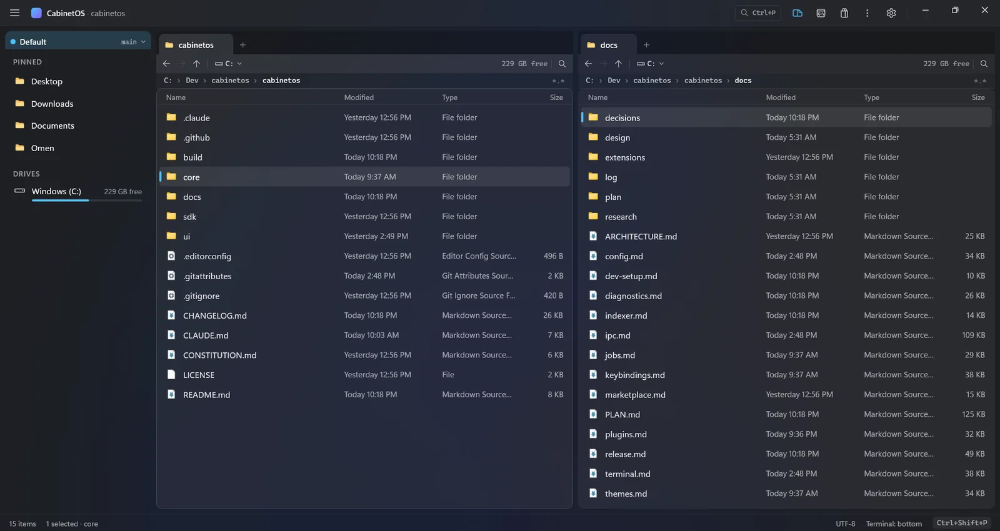
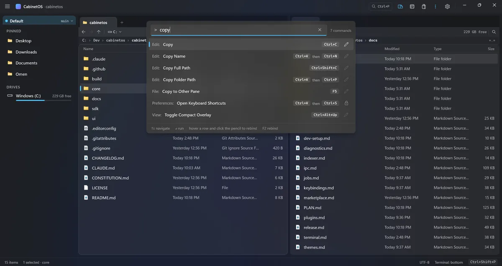
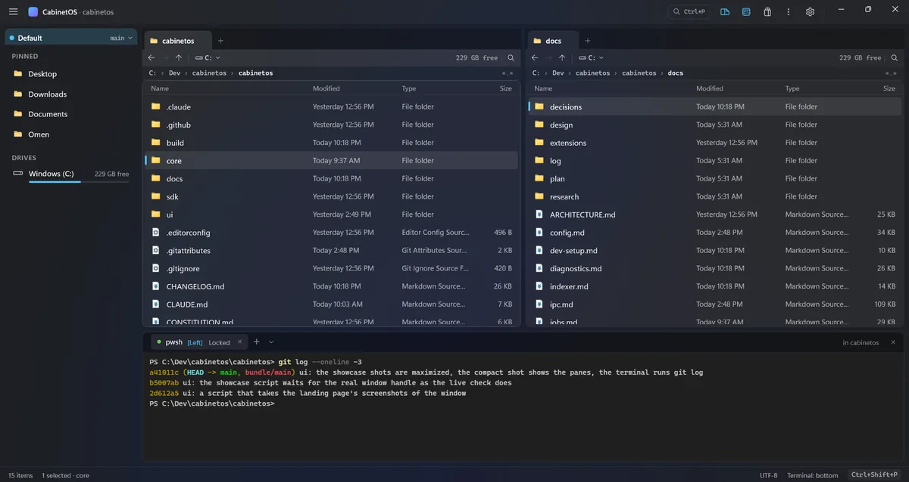
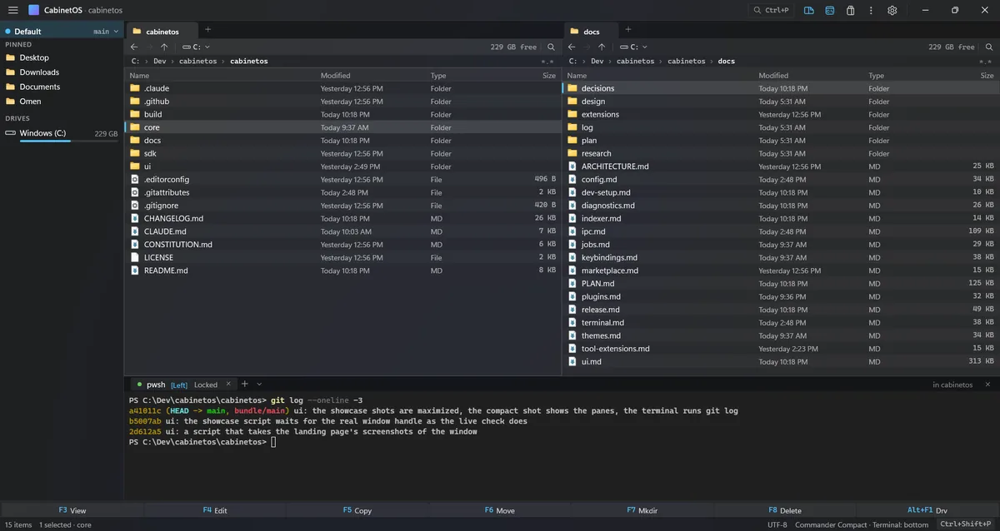
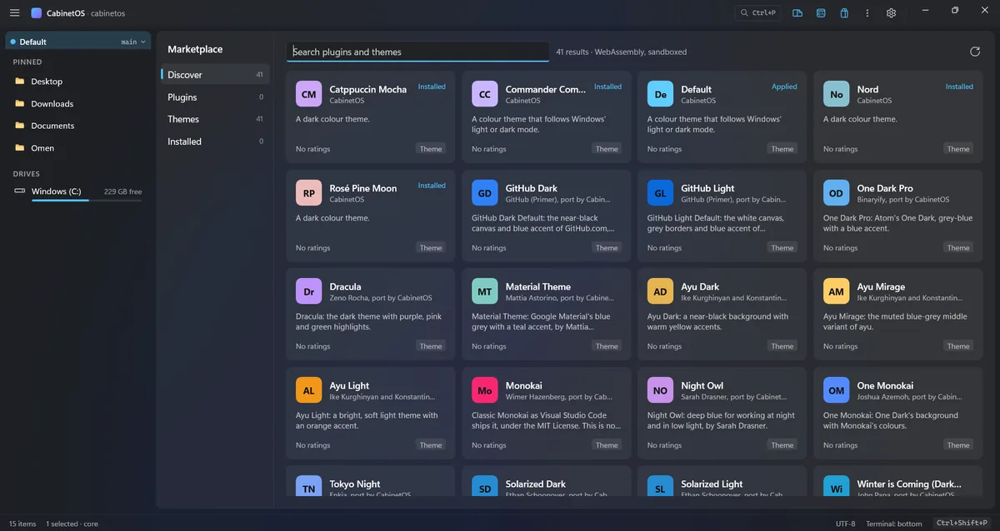

## Panes and navigation

### Two panes, or one

Two file panes side by side, or one at a keystroke. Each pane has back, forward and up, pinned folders, and the drives with their free space.

### Tabs and path

Each pane has its own tab strip, with a "+" button from the first tab. A middle click closes any tab, and Ctrl+1 to Ctrl+9 bring a pane's tabs to the front. Under the tabs, a toolbar row has Back, Forward and Up, a drive chip that opens the drive list (as Alt+F1 and Alt+F2 do), the drive's free space, and Find. A path row shows the folder's path, whole up to 5 parts with two panes (8 with one), and Ctrl+L types a path.

### The column view

Ctrl+Alt+C ("Toggle Column View") shows a pane's tab as columns of names, as Finder does. Enter, Right or a click on a folder opens it in a column to the right, and Left goes back up. The whole path stays on screen, and the tab keeps the mode across a restart.

### Column widths

The file panes' column widths are yours, in any theme. Drag the grip at a divider of the column headers, or double-click a heading (or a grip) to fit its column to the texts on screen. Both panes share the widths, and they are saved in `cabinetos.json` as `ui.columns`. "Reset Column Widths" in the palette gives the theme's widths back.

### Folder sizes

Turn on `panes.folderSizes` in `cabinetos.json`, or run "Toggle Folder Sizes" from the palette, and each folder's Size is counted when a listing opens, with no key. It is off by default, because counting costs disk time. A pane that leaves a folder stops its count.

### Fast listings

Folder listings are read with the NT API and handed to the window through shared memory: 100,000 entries in about 50 ms. Open folders refresh when their contents change on disk, and drives appear and disappear as they are plugged in. Type names and icons are the ones Windows Explorer shows.

### One top row

The top row is also the window's drag area. The title "CabinetOS · folder" follows the active pane's tab, and a small Quick Open chip (Ctrl+P) stands before the view and Settings buttons. The workspace switcher is the sidebar's first row: the workspace, its branch and a chevron. A click or Ctrl+K Ctrl+W opens the dropdown, and picking the workspace goes to its root in the left pane.

## File operations

### Copy, move, rename and delete

Copy (F5), move (F6), new folder (F7) and rename (F2). Delete goes to the Recycle Bin. Delete for good (Shift+Delete) asks for a confirmation first.

### One copy queue per disk

There is one copy queue per physical disk: one job at a time on a hard disk, several on an SSD. A job can be paused, resumed or cancelled, and a live speed graph shows how fast it goes.

### Conflicts stop only one file

A file conflict pauses only that file. You can skip it, replace it, or copy it under a new name, once or for every conflict of its kind.

### Open and Properties

Open a file with its default program, or a folder in the other pane. Properties works for any row.

### The right-click menu

The right-click menu comes from `contextMenu` in `cabinetos.json`: for the empty space, a file, a folder and a selection of several rows. Each has its row of icons and its list, and rows can be shown only for some file extensions. It is WinUI's command bar menu, as Windows 11's Explorer shows it.

### Edit the menu inside the menu

"Edit Menu…" at the end of the right-click menu edits the menu inside the menu. Drag a row or move it with Alt+Up and Alt+Down, remove it with its X or Delete, add a command (Insert, from a list like the palette's) or a separator. Done (Ctrl+S) saves it to `cabinetos.json` through the core, and Esc cancels. The row of icons, the extension filters and the programs are still edited in the file, which Ctrl+, opens.

### Windows' own context menu

Shift+right-click or Ctrl+Shift+F10 opens Windows' own context menu (Open with, Send to, what other programs add), when `contextMenu.shellMenu` is on.

## Search

### Search as you type

Search as you type in the current folder, or across a whole volume. Find in Pane (Ctrl+F) filters the active pane's list by name as you type, and Esc shows every row again. The search through subfolders is the Search view (Ctrl+Shift+F), which the classic and right layouts show in the sidebar's place.

### Quick Open

Quick Open (Ctrl+P) lists the files and folders of the workspace on the command palette's surface, and `>` switches to the commands. Enter opens a row in the active pane, and Ctrl+Enter opens it in the other one.

### An optional indexer

An optional indexer service reads the NTFS master file table and change journal, for instant search of whole volumes. Install it with `install.ps1 -AllUsers -Indexer`.

## Commands and keys

### The command palette

The command palette (Ctrl+Shift+P) finds every command by name, shows its keys, and changes them in place.

### Chord keys

Chord keys such as Ctrl+K then Ctrl+T are supported. A protected set of system keys cannot be rebound away.

### Programs of your own

Programs of your own (`programs` in `cabinetos.json`) become commands (`program.<name>`) for the menu, a key or the palette. `{path}`, `{selection}` and `{cwd}` in their arguments stand for the cursor row, the selection and the folder.

## Terminal

### An integrated terminal

The terminal (`` Ctrl+` ``) has PowerShell, Command Prompt and WSL profiles. A fourth profile, `claude`, runs Claude Code on your own login. `` Ctrl+` `` works for the pane you press it in: it shows that pane's terminal with the keyboard, or starts one in the pane's folder.

### Each terminal belongs to a pane

Each terminal belongs to a file pane. Its tab shows `[Left]` or `[Right]` and a Locked/Linked switch ("Lock or Link Terminal to Its Pane" in the palette). Command Prompt and Claude Code stay locked, and the tooltip says why. `terminal.defaultMode` (`locked` or `linked`, `locked` by default) is the mode a new terminal starts in.

### A linked terminal follows its pane

A linked PowerShell or WSL terminal follows its pane: each time the shell shows its prompt, it changes to the folder the pane shows, if the pane moved. Nothing is typed into the shell, so a half-typed line or a running program is never touched. A `cd` of your own stays until the pane moves again. It costs about 20 ms per prompt, and `"hook": false` on a profile in `cabinetos.json` turns it off.

### The caption follows the shell

The terminal's caption says "in docs" for the folder the shell is in, after a `cd` of your own too, and its tooltip names the whole folder. `cab term cwd` prints the folder a linked terminal follows.

### Keys for the terminal's tabs

While the terminal has the keyboard, Ctrl+Shift+T opens a terminal for the active pane, Ctrl+Shift+W closes the one in front, and Alt+[ and Alt+] show the tab before or after it. They also work on the Ukrainian keyboard layout. Ctrl+Shift+C copies the selected text and Ctrl+Shift+V pastes.

### Split the dock under the panes

Ctrl+\ in the terminal splits the dock under the two panes: the left pane's terminals sit under the left pane and the right pane's under the right. Each half has its own tab row, header and caption. The split is saved as `terminal.split` in `cabinetos.json`, and it is off by default.

### Tabs come back after a restart

The window saves its terminal sessions in `cabinetos.json` (`terminal.tabs`). The first time you show the dock after starting, they start again as fresh shells in the folders they were left in, with the same tab in front. `terminal.restore: false` turns it off.

### cabinetos-cli and cab

`cabinetos-cli` reaches the core's functions from a terminal. In a release it is also called `cab`, and both are on the `PATH` of every terminal.

In a CabinetOS terminal, `cab pane` prints the folder of the active pane, and `cab selection` prints the active pane's selected paths, one per line. `cab copy --selection --dest opposite_pane` and `cab move --selection --dest opposite_pane` run the core's job on that selection and follow it. They refuse while only one pane is shown. The exit code is 0 when it worked, 1 for a failure, and 2 when there is no window or nothing is selected.

## Themes and the settings file

### Colour themes

Colour themes are JSON files with an accent, a Mica tint, a palette and terminal colours. They apply live, and the theme picker (Ctrl+K Ctrl+T) switches between them. Default, Nord, Catppuccin Mocha and Rose Pine Moon are built in. Default follows Windows' light or dark mode.

### Preview in the theme picker

The theme picker previews the highlighted theme live, whether the keys or the pointer moved the highlight. Enter or a click keeps it, and Esc keeps the current theme.

### Badge colours for the terminal

A theme may set `terminalLeftBadge` and `terminalRightBadge`, the colours of the `[Left]` and `[Right]` badges. Without them, the left badge is the accent and the right badge is the accent with its hue turned by 150 degrees. The theme format is version 3.

### One settings file

Every setting lives in `cabinetos.json`. A saved change applies while CabinetOS runs, and Ctrl+, opens the file for editing.

### Compact overlay

"Toggle Compact Overlay" (Ctrl+Alt+Up) makes the window a small always-on-top drawer with one pane, no sidebar and no dock. It is 480 by 640 or the size you last gave it (`ui.compactOverlay`), and it brings the window back as it was.

## Plugins, tools and the marketplace

### Core Plugins

Core Plugins are WebAssembly components that run in a sandbox. They get only the capabilities you grant in a review dialog. A plugin that crashes is stopped while CabinetOS keeps running.

### Tool Extensions

Tool Extensions are web pages in WebView2. Each one runs in a browser process of its own and has no network access. Markdown Preview is the first. It is opt-in, in the release's `extras` folder.

### The marketplace

A marketplace view installs plugins, themes and tools from a static index, and checks each download's SHA-256. No public index exists yet.

## Install, updates and diagnostics

### A setup file

The setup file `CabinetOS-<version>-win-x64-setup.exe` installs CabinetOS for you alone, with no administrator rights, into `%LOCALAPPDATA%\Programs\CabinetOS`. It adds a Start Menu shortcut, a desktop shortcut if you tick it, and "Start CabinetOS" at the end. It checks the .NET 10 runtime, the Windows App Runtime and WebView2 first, and names the winget command for a missing one. Settings > Apps removes it, and your settings and logs stay. `/VERYSILENT /SUPPRESSMSGBOXES /NORESTART /LOG=<file>` installs with no window.

### The zip and install script

The release also has a zip with an install script. It installs per user without administrator rights, or for all users. The Start Menu entry, the `PATH` entry and the indexer service are added only when you ask. An uninstall script is included, with the license text of every third-party component. CabinetOS appears in Settings > Apps, with its version and size, and uninstalls from there.

### Updates from inside the app

For the per-user install, CabinetOS checks for an update once a day (`update.check`, and `update.channel` for the stable or the preview channel). The download runs in the background with a pill in the status bar. There is a rollback to the version before. A download whose SHA-256 does not match is deleted, and a swap that fails half way puts the old version back. `cabinetos-cli update` does the same from a terminal.

### Updates install themselves

Once a newer version is downloaded and its SHA-256 checked, CabinetOS puts it in place in the background. The status bar only says "CabinetOS 0.2.0 is installed; restart to use it", with Restart now and Later, and the text opens the release notes. Later keeps your session, and the next start runs the new version. If the update cannot be put in place, the status bar says so and the next daily check tries again. `update.autoInstall: false` in `cabinetos.json` brings back the dialog that asks before the update.

### Logs and crash traces

There is one JSON Lines log per program and day. A request ID follows each action from the window through the core. A crash writes a trace that names where it happened: the window, the core or a plugin.

## Changed and removed

**Changed**

- Total Commander's "path to the command line" (Insert Folder Path) moves from Ctrl+P to Ctrl+Alt+P, because Ctrl+P is Quick Open.
- Ctrl+F and Alt+F7 open the pane's find widget. The search through subfolders is the Search view (Ctrl+Shift+F), which the classic and right layouts show in the sidebar's place.
- A pane's tab strip shows from the first tab, with a "+" button. A middle click closes any tab.
- The terminal does not follow the active pane. Clicking a pane, switching panes or opening a folder never changes the terminal in front and never types into a shell, unless you link it to its pane. `cabinetos-cli term mode` locks or links a terminal.
- `cabinetos-cli update download` also puts the new version in place, unless `update.autoInstall` is `false`. `update apply` is for a download made with it off.
- The shell follows v2 of the redesign. The top row is quieter, and the workspace pill and the centred command center are gone.
- The tabs of a pane are a recessed band with the tab in front as a card in the toolbar's fill. The other tabs are lower, with dividers between them, and every tab has a folder glyph (or its lock, or its tool's). The "Open with…" button sits in the toolbar, hidden until a second editor exists.
- Themes may size the new rows: `toolbarRowHeight`, `pathRowHeight`, `workspaceHeaderHeight`, `quickOpenChipHeight` and `tabMaxWidth` are new metrics. Commander Compact is version 1.2.0 with all of them.
- CabinetOS shows its first folders about 0.2 s sooner, because the core starts while the window is still being built.
- Find in pane, marking by a pattern and quick search go through the names of a large folder about 2.5 times faster: 100,000 names in about 17 ms instead of 40 to 50 ms.
- The first right-click menu of a session opens a little sooner, because the menus are built while the window is idle after start.
- The marketplace shows its first cards without a pause: it makes the cards that fill the view at once and the rest a screenful at a time. Its longest frame at the first opening is about 42 ms.
- Going back to the tab a pane showed just before does not list its folder again. The pane keeps that tab's listing for 30 seconds, with its cursor and marks, so a tab on 100,000 files is back on screen in about 17 ms instead of 60 to 90 ms.
- The file lists keep half a screen of rows made above and below the view instead of two screens. Changing into or out of Commander Compact freezes the window for about 25 ms less, and scrolling a large folder does less work.
- Icons come with the rows: the core draws the folder and file icons while the window starts, and the icons of a folder's file types right after it sends the listing.
- The release build compiles the window ahead of time (ReadyToRun), so CabinetOS starts 0.14 to 0.24 s sooner. The download is about 5 MB bigger.
- Shortcuts work while a text box has the keyboard, when they type nothing there: Ctrl+B, Ctrl+Tab, Alt+Left, Ctrl+K Ctrl+T and the function keys run their command. In a pane's find box and address box the pane's keys work too: F5 copies the cursor row to the other pane, Ctrl+T opens a tab.
- Quick Open and the search of a folder, when no indexer answers, keep only the best hits while the core walks the folders. A walk of 100,000 names answers about 10 ms sooner.

**Fixed**

- The right-click menu opens inside the window also on a busy computer, and flips above the pointer near the window's bottom edge when it must.
- In the edit mode of the right-click menu, Delete takes out the row that has the keyboard, also right after Alt+Up or an added command.
- The command palette ignores a search answer that comes after it closed. Before, closing it in the few milliseconds the core needs to answer could end with an error in the log.
- A click from the terminal into a file pane gives the pane the keyboard: the keys pressed right after it (Home, Enter, Backspace, any pane key) act on the pane.
- A run of the window that ended without closing is noted in the log at the next start: a WARN line, `previous run ended without closing`.
- Quick Open and the search of a folder find names after the first 20,000 entries of a large folder. The walk without the indexer now stops after 2 s or 200,000 entries. When it still stops early, Quick Open says "Not every name was searched" under its rows.
- The command palette opened from a tool's page, such as a Markdown Preview, gives the keyboard back to that page when it closes.
- Esc while a chord waits for its second key ends the wait, and Ctrl+Shift+P there ends it and opens the command palette.
- Tab stays inside the permissions review while it is open, as in the plugin list, instead of moving the keyboard to the window under it.
- A shortcut held down runs once. Holding Ctrl+Shift+P, `` Ctrl+` `` or Ctrl+B no longer makes the palette, the terminal or the sidebar open and close again and again.
- Tab switches panes again after a click on a button of the top row. The buttons of the top row, the status bar, the breadcrumbs, the tab strips and the dock no longer take the keyboard from a click.
- The right-click menu opens with its top-left corner at the pointer, as Explorer's does, and hangs above or to the left of the pointer near the window's edge. From the keyboard it hangs under the focused row.
- A chord pressed where it does not work says where it does, for example "Ctrl+K Ctrl+T does not work while you type in a box. Esc leaves the box.", instead of "is not bound to a command".
- A chord works however long its first key is held, so Ctrl+K Ctrl+T, Ctrl+K V and the other chords work every time.
- Tab no longer takes the keyboard out of the theme picker or the plugin list while they stay open.
- Tab gives the keyboard to a Markdown Preview (or another tool) shown in the other pane.
- The keyboard works in dialogs: Tab and the arrows move between the buttons, and Enter and Space press one.
- Shift+F10 or the Menu key on a focused row that was scrolled out of view no longer closes CabinetOS without a word. The menu opens near the top of the pane instead.
- Ctrl+Tab, Ctrl+Shift+Tab, Ctrl+W, Ctrl+T and Ctrl+1 to 9 work while the keyboard is in a tool's page, such as a Markdown Preview or the agent's chat. The terminal passes back Ctrl+Tab and Ctrl+Shift+Tab only, because Ctrl+W and Ctrl+T are shell keys.
- Only one overlay is open at a time. Opening the theme picker, the command palette, Quick Open, a prompt or the plugin list closes the one that was open, and Esc closes the one on screen.
- A plugin's folders and the folders a pane opens are compared in their long form, so a short 8.3 spelling such as `C:\Users\CABINE~1\AppData\Local\Temp` is the same folder as `C:\Users\cabinetos\AppData\Local\Temp`.
- `CabinetOS.exe` has its own icon, the blue folder with the terminal badge, in the taskbar, in Explorer and in the Alt+Tab list.

**Removed**

- The title bar with its workspace tab, the command bar, the global address bar and the global search field, and the pane's header. The top row and each pane's tab strip and path row replace them. No setting of `cabinetos.json` served only these parts. The theme metrics that sized them are still accepted and size nothing.
