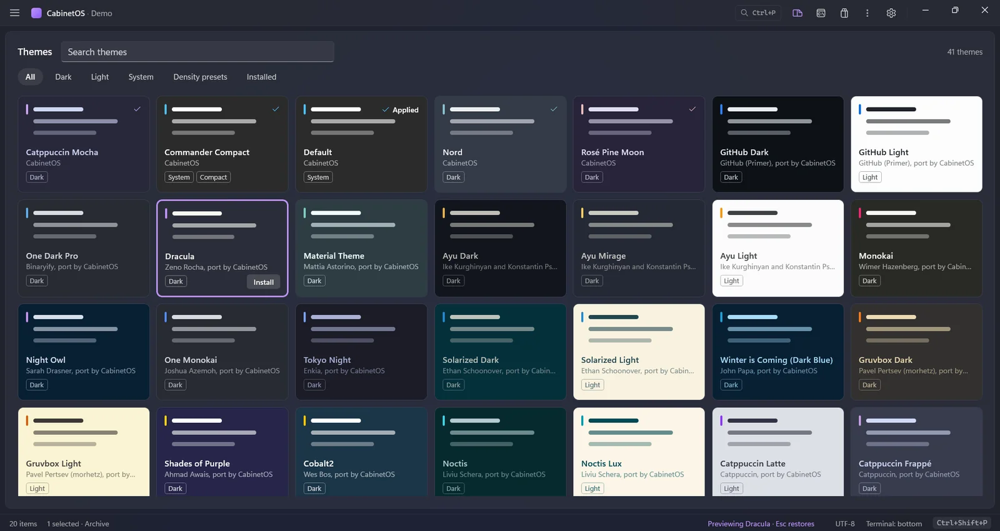
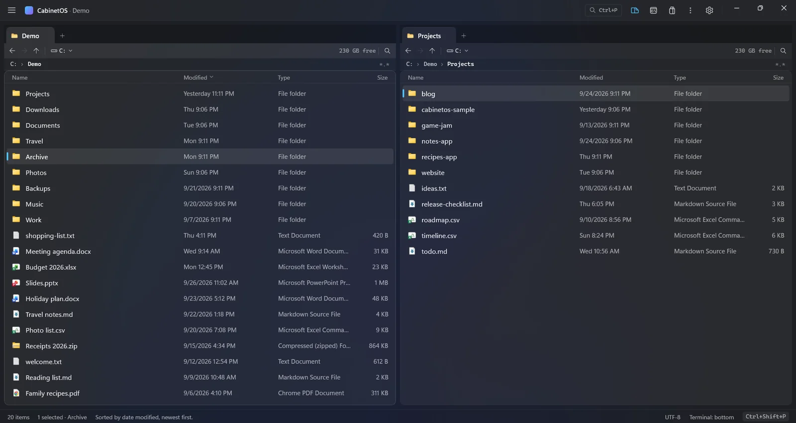

## Themes and the settings file

### The theme gallery

The themes as colour tiles, each painted in the theme's own colours, with filters for dark, light, system themes, density presets and the installed ones (Windows' mode first), and a search. Selecting a tile previews the theme on the whole window with nothing installed or written, and Esc paints the theme in effect again. Enter or a double-click installs a theme and applies it. Open it with "Themes: Browse" in the command palette (`themes.browse`; bind it to keys if you like) or the new last row of the theme picker, "Browse more themes…". If the themes catalogue cannot be read, the gallery shows your installed themes and says so.

### Four settings, three ways

Four settings that could be changed only by editing `cabinetos.json` now have a command and a control in the window. The layout (`ui.layout`): "View: Classic Layout", "View: Terminal on the Right" and "View: Activity Rail" in the palette, "View: Next Layout" on Ctrl+K Ctrl+L, and a "Layout" menu in the top row's menu that checks the current one. Hidden files (`panes.showHidden`): "View: Toggle Hidden Files" on Ctrl+K Ctrl+H, a "Show Hidden Files" row in the top row's menu, and the word "hidden" in the status bar while they are shown. The Explorer following the active pane (`ui.sidebarAutoReveal`): "Sidebar: Follow the Active Pane" in the palette, a pin in the Explorer view's header, and a "Follow the Active Pane" row in the top row's menu. Windows' own menu on Shift+right-click (`contextMenu.shellMenu`): "Menu: Toggle Windows' Shell Menu" in the palette and a check box at the end of "Edit Menu…". Each is the same change whichever way you make it: the file, the palette and the window follow each other at once.

## Panes and navigation

### Sort by a column heading

A click on the Name, Modified, Type or Size heading of a file pane sorts that pane by the column, and a second click reverses it. The sorted heading shows a small arrow. It is the same sort as Ctrl+F3 to Ctrl+F6 and the palette's "View: Sort by ..." commands, so the three ways agree; the order is the pane's own, and Type sorts by extension. A double-click on a heading still fits the column, and leaves the order as it was.

### A divider between the panes

Drag it to give the left pane more or less of the width. The share is kept in the new setting `ui.paneSplit` (0.2 to 0.8, `null` for equal), so it survives a resize of the window. A double-click on the divider and the new palette command "View: Equal Panes" (`view.equalPanes`, no key) make the panes equal again; editing `ui.paneSplit` in `cabinetos.json` moves the divider. A pane never gets narrower than its columns need.

### The sidebar's divider in every layout

The sidebar's divider works in the classic layout and in the right layout too, not only in the rail layout. A drag still saves `ui.sidebarWidth`, and a double-click on the divider gives the design's width back.

## Changed and removed

**Changed**

- The marketplace page is now the Extensions page (Discover, Plugins, Tools and Installed, "Search extensions") and lists no themes. Themes come from a catalogue of their own, `themes.json`, at `marketplace.themes` (the public address by default); `index.json` lists plugins and tools only. The command keeps its ID and is now called "Marketplace: Browse Extensions"; the core's protocol version is 20, and `cabinetos-cli market` has `--themes` to ask for the themes catalogue.
- `cabinetos-core.exe`, `cabinetos-cli.exe` (and its copy `cab.exe`) and `cabinetos-indexer.exe` carry a Windows version resource: version, description, copyright and the CabinetOS icon. Explorer's Properties > Details page shows it, and the code signing service requires it before it signs a program.
- The release zip and the setup file no longer hold the `.pdb` symbol files: they are a download of their own, `CabinetOS-0.1.2-win-x64-symbols.zip`. The release zip is 32 MB instead of 76 MB and the setup file 20 MB instead of 43 MB. A crash trace from an install names function, file and line once you unpack the symbols of the same version next to the programs.
- `cabinetos-indexer --install` registers the service with an automatic, delayed start and starts it once, so the index is there after every restart of Windows with nobody starting the service (it was a manual start, off after each restart). `install.ps1 -AllUsers -Indexer` does the same. If you registered the service by hand before, run `cabinetos-indexer --uninstall` and then `--install` again.

**Removed**

- Nothing.

## Fixed

- The plugin sandbox runs on wasmtime 49.0.2, which closes seven security advisories of 49.0.1 (RUSTSEC-2026-0321 to 0327). None was reachable without a plugin written to exploit it.
